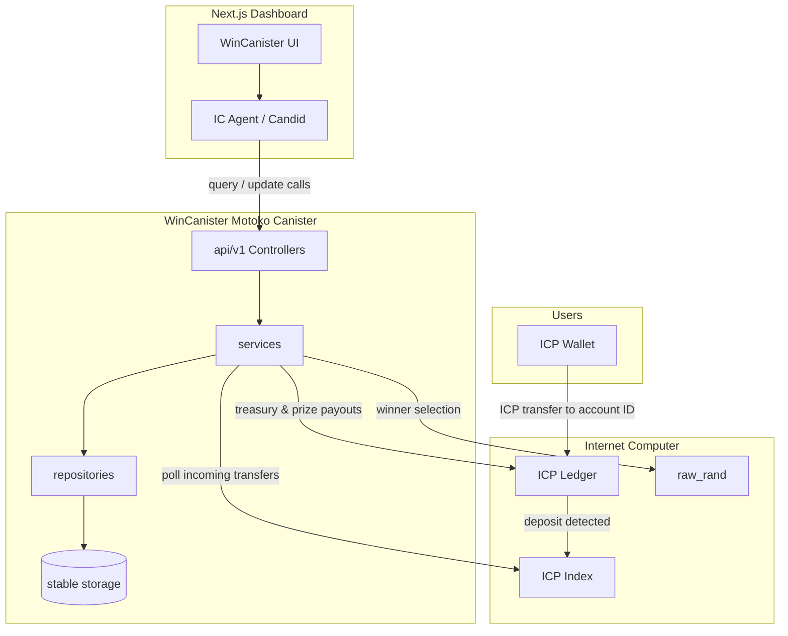
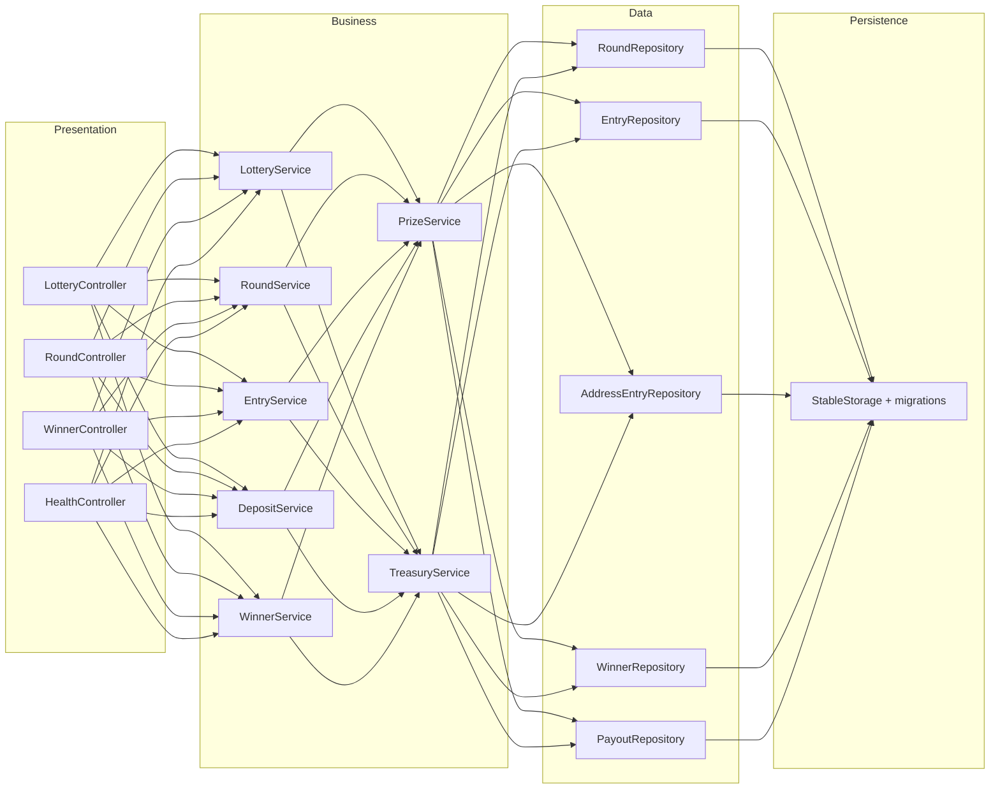
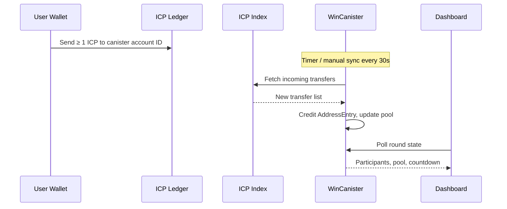

# WinCanister

**Decentralized 24-hour ICP lottery on the Internet Computer.**

WinCanister runs transparent daily rounds on-chain: users deposit ICP to a canister account ID, entries are credited automatically, and winners are drawn with ICP-native randomness when the timer ends. The protocol keeps **1% treasury** and pays **99%** to the top three winners (60% / 25% / 15%).

[](LICENSE)

## Live

| | |
|---|---|
| **Repository** | [github.com/prasangapokharel/WinCanister](https://github.com/prasangapokharel/WinCanister) |
| **Canister** | `ulahq-iyaaa-aaaao-bbcoq-cai` |
| **Network** | IC Mainnet |

## Features

- **Address-based deposits** — send ICP from any wallet (NNS, Plug, etc.); no wallet connect required on the UI
- **Automatic entry crediting** — canister polls the ICP index for incoming transfers
- **24h rounds** — live countdown, pool stats, and activity feed
- **Verifiable payouts** — winner addresses and ledger transaction IDs recorded on-chain
- **Upgrade-safe** — stable memory migrations for rounds, entries, winners, and treasury

## Architecture

### System overview



### Canister layers



| Layer | Path | Responsibility |
|---|---|---|
| Controllers | `src/api/v1/` | Thin Candid endpoints — validate input, call services, map responses |
| Services | `src/services/` | Business rules: rounds, entries, deposits, draws, treasury, payouts |
| Repositories | `src/repositories/` | Read/write domain data — no business logic |
| Storage | `src/storage/` | Stable memory maps and upgrade-safe persistence |
| Ledger | `src/ledger/` | ICP ledger transfers and index polling |
| Frontend | `frontend/` | Next.js dashboard — pool stats, countdown, deposit QR, live feed |

### Deposit flow



### Prize split

| Place | Share |
|---|---|
| Winner 1 | 60% of prize pool |
| Winner 2 | 25% of prize pool |
| Winner 3 | 15% of prize pool |
| Protocol treasury | 1% of total pool |

## Prerequisites

- [dfx](https://internetcomputer.org/docs/current/developer-docs/setup/install) ≥ 0.24
- [mops](https://mops.one/) + Motoko 1.7
- Node.js 20+

## Quick start

### 1. Clone and install

```bash
git clone git@github.com:prasangapokharel/WinCanister.git
cd WinCanister

cd frontend && npm ci && cp .env.example .env.local && cd ..
```

### 2. Build canister wasm

```bash
DFX_NETWORK=ic bash scripts/build-lottery.sh
```

### 3. Run frontend locally

```bash
cd frontend
npm run dev
```

Open [http://localhost:3000](http://localhost:3000).

## Frontend scripts

```bash
cd frontend
npm run dev        # development server
npm run build      # production build
npm run typecheck  # TypeScript check
npm run lint       # ESLint
```

## Mainnet deploy

```bash
DFX_NETWORK=ic bash scripts/build-lottery.sh

dfx canister install <CANISTER_ID> --network ic \
  --wasm .mops/.build/lottery.wasm --mode upgrade --wasm-memory-persistence keep

dfx canister call <CANISTER_ID> processIncomingDeposits --network ic
```

See `scripts/deploy-mainnet.sh` and `scripts/verify-mainnet.sh` for helper flows.

## Configuration

| Variable | Description |
|---|---|
| `NEXT_PUBLIC_LOTTERY_CANISTER_ID` | Lottery canister principal |
| `NEXT_PUBLIC_DFX_NETWORK` | Set to `local` for local replica |
| `NEXT_PUBLIC_IC_HOST` | IC HTTP endpoint (default `https://icp0.io`) |

## Project structure

```
WinCanister/
├── src/
│   ├── api/v1/          # Candid controllers
│   ├── services/        # Business logic
│   ├── repositories/    # Data access
│   ├── storage/         # Stable memory
│   ├── ledger/          # ICP ledger + index clients
│   ├── migrations/      # Upgrade migrations
│   └── main.mo          # Canister entrypoint
├── frontend/            # Next.js dashboard
├── scripts/             # Build & deploy helpers
├── dfx.json
└── mops.toml
```

## Contributing

Contributions are welcome! Please read [CONTRIBUTING.md](CONTRIBUTING.md) before opening a pull request.

1. Fork the repo
2. Create a feature branch (`git checkout -b feat/my-change`)
3. Run frontend checks (`npm run typecheck`, `npm run lint`, `npm run build`)
4. Open a PR with a clear description

## License

Apache-2.0 — see [LICENSE](LICENSE).
