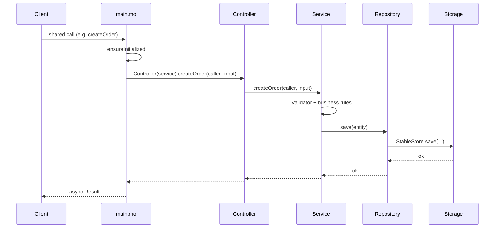

# Motoko Code Guide — Architecture & Development Flow

A step-by-step guide for writing production Motoko canisters using layered architecture, enhanced migration, and test-driven workflows. Use this for **any** ICP backend — trading, vault, registry, game, etc.

---

## 1. Standard folder layout

```text
src/
├── main.mo                     # Actor entrypoint — wire only, no business logic
├── migrations/                 # Enhanced migration chain (timestamp-prefixed)
│   ├── YYYYMMDD_HHMMSS_Init.mo
│   └── YYYYMMDD_HHMMSS_AddField.mo
├── api/
│   └── v1/                     # Versioned public API surface
│       ├── HealthController.mo
│       └── *Controller.mo
├── services/                   # Business logic & orchestration
├── repositories/               # Data access (CRUD, queries)
├── storage/                    # Stable memory — only layer that touches persistence
├── models/                     # Domain entities (Round, User, Order, …)
├── dto/                        # API response/request shapes (not domain internals)
├── validators/                 # Input & rule validation
├── config/                     # App constants, canister IDs, defaults
├── types/                      # Shared type aliases (ledger, external APIs)
├── utils/                      # Pure helpers (Logger, time, formatting)
├── ledger/                     # External canister clients (optional)
├── randomness/                 # ICP randomness wrappers (optional)
└── testing/                    # TestHarness, fixtures (used by backend/testing)

backend/
└── testing/
    └── <feature>/
        └── FeatureTests.test.mo

scripts/
├── build-lottery.sh            # moc 1.7 + --enhanced-migration
├── run-tests.sh
├── deploy-mainnet.sh
└── verify-mainnet.sh
```

**One file = one responsibility.** Prefer many small modules over one large file.

---

## 2. Layer rules (strict)

### Allowed dependencies

```text
Controller  →  Service
Service     →  Repository, Validator, external client
Repository  →  Storage
```

### Forbidden

```text
Controller  →  Repository, Storage
Service     →  Storage (direct)
Storage     →  Service, Controller, Repository
Repository  →  Service (business rules)
```

### What each layer does

| Layer | Owns | Must NOT contain |
|-------|------|------------------|
| `main.mo` | Public `shared` / `query` funcs, service wiring, `<system>` hooks | Validation, storage, workflows |
| `api/v1/` | Forward `msg.caller`, map to service, return DTOs | Business rules |
| `services/` | Workflows, domain rules, `Result` errors | HTTP, stable memory |
| `repositories/` | `findById`, `save`, `update`, `delete` | Prize math, auth policy |
| `storage/` | Maps, stable types, `toStable` / `fromStable` | Business decisions |
| `models/` | Entity records & variants | API formatting |
| `dto/` | Public response records | Internal state |
| `validators/` | Caller, amount, state checks | Side effects |

---

## 3. End-to-end request flow



### Query flow (read-only)

```text
Client → main.mo → build service → TransparencyService / Repository → DTO → Client
```

Query methods may skip controllers when reads are simple, but **never** read storage directly from `main.mo`.

---

## 4. How to add a new feature (workflow)

Example: add `getOrderHistory` to an e-commerce canister.

### Step 1 — Model (if new entity fields needed)

`src/models/Order.mo`

```motoko
module {
  public type Order = {
    id : Nat;
    buyer : Principal;
    amount : Nat;
    status : { #pending; #paid; #shipped };
  };
};
```

### Step 2 — Storage (if new collection)

`src/storage/StableOrderStore.mo` — `Store`, `StableData`, `empty()`, `save`, `findById`.

Register in `StableStorage.mo` aggregate if using a central store record.

### Step 3 — Migration (if persistent state changes)

New file: `src/migrations/20250621_120000_AddOrders.mo`

```motoko
import StableStorage "../storage/StableStorage";

module {
  public func migration(old : { storage : StableStorage.Store }) : { storage : StableStorage.Store } {
  // Transform or extend old.storage.orders if needed
    { storage = old.storage };
  };
};
```

**First migration ever** must initialize **all** actor persistent fields:

```motoko
public func migration(_ : {}) : { storage : StableStorage.Store; isInitialized : Bool } {
  { storage = StableStorage.empty(); isInitialized = false };
};
```

### Step 4 — Repository

`src/repositories/OrderRepository.mo`

```motoko
public class Repository(store : StableOrderStore.Store) {
  public func findByBuyer(p : Principal) : [Order.Order] { ... };
  public func save(order : Order.Order) { ... };
};
```

### Step 5 — Service

`src/services/OrderService.mo` — validation, rules, orchestration.

```motoko
public func getHistory(caller : Principal) : [Order.Order] {
  orderRepo.findByBuyer(caller);
};
```

### Step 6 — DTO (public shape ≠ internal model)

`src/dto/OrderHistoryResponse.mo`

```motoko
public type OrderHistoryEntry = {
  orderId : Nat;
  amount : Nat;
  status : Text;
};
```

### Step 7 — Controller

`src/api/v1/OrderController.mo`

```motoko
public class Controller(orderService : OrderService.Service) {
  public func getHistory(caller : Principal) : [OrderHistoryResponse.OrderHistoryEntry] {
    orderService.getHistory(caller);
  };
};
```

### Step 8 — Expose in main.mo

```motoko
public query func getOrderHistory() : async [OrderHistoryResponse.OrderHistoryEntry] {
  OrderController.Controller(buildService()).getHistory(Principal.fromActor(???));
  // For authenticated reads use shared(msg) and msg.caller
};
```

### Step 9 — Tests

`backend/testing/order/OrderTests.test.mo`

```motoko
import { suite; test } "mo:test/async";
import { expect } "mo:test";
import TestHarness "mo:src/testing/TestHarness";

suite("Order Tests", func() : async () {
  await test("empty history", func() : async () {
    let harness = TestHarness.create(seed);
    let history = harness.orderService.getHistory(participant);
    expect.nat(history.size()).equal(0);
  });
});
```

Run: `bash scripts/run-tests.sh`

---

## 5. main.mo rules

### Persistent actor fields (enhanced migration)

```motoko
actor MyCanister {
  var storage : StableStorage.Store;   // NO initializer
  var isInitialized : Bool;            // NO initializer

  // Services: build on demand OR use transient WITH initializer
  // NEVER: transient var service : Service;  // traps on install
};
```

**Never use** `preupgrade` / `postupgrade` / `stable` keyword with enhanced migration.

### Wiring pattern

```motoko
func buildService() : MyService.Service {
  MyService.Service(
    OrderRepository.Repository(storage.orders),
    ConfigRepository.Repository(storage.config),
  );
};

func ensureInitialized<system>() {
  if (not isInitialized) {
    buildService().initialize();
    scheduleTimers<system>();
    isInitialized := true;
  };
};

public shared (msg) func doAction(input : Nat) : async Result.Result<Nat, Text> {
  ensureInitialized<system>();
  await MyController.Controller(buildService()).doAction(msg.caller, input);
};
```

### Timers

Only `<system>` functions may start timers. Call them from `ensureInitialized<system>()`.

---

## 6. Naming conventions

| Kind | Style | Example |
|------|-------|---------|
| Files | PascalCase | `OrderService.mo` |
| Functions | camelCase verb | `createOrder`, `findById` |
| Variables | camelCase | `currentRoundId` |
| Constants | UPPER_SNAKE | `MIN_DEPOSIT_AMOUNT` |
| API folder | versioned | `api/v1/`, later `api/v2/` |

---

## 7. Error handling

Use `Result.Result<T, Text>` for expected failures. Never `assert false` for user input.

```motoko
// Good
if (amount < MIN_AMOUNT) {
  return #err("amount_too_low");
};

// Bad
assert(amount >= MIN_AMOUNT);
```

Log meaningful events only: created, accepted, paid, upgraded — not every read.

---

## 8. Security checklist

- [ ] Always use `msg.caller` — never trust frontend-supplied principals for auth
- [ ] Validate amounts, state, duplicates in service + validator
- [ ] Admin-only methods check against config principal
- [ ] Randomness: use `raw_rand()` / `Random.blob()` — never time-based seeds
- [ ] Ledger transfers: verify block index / balance after external calls
- [ ] Upgrade: every critical field survives via migration chain

---

## 9. Enhanced migration reference

Configured in `mops.toml`:

```toml
[moc]
args = ["--default-persistent-actors"]

[canisters.my_canister]
main = "src/main.mo"

[canisters.my_canister.migrations]
chain = "src/migrations"
```

| Migration input/output | Meaning |
|------------------------|---------|
| In input and output | Transform field |
| Output only | Add field |
| Input only | Remove field |
| In neither | Carried through unchanged |

Files run in **lexicographic order** — always prefix with `YYYYMMDD_HHMMSS_`.

**Runtime:**

- Fresh install → all migrations run
- Upgrade → only new migrations run
- Failed migration → upgrade aborted, old wasm kept

Verify chain: `mops check --fix` (when mops toolchain is initialized).

---

## 10. Testing structure

```text
backend/testing/
├── order/OrderTests.test.mo
├── payment/PaymentTests.test.mo
├── upgrade/UpgradeTests.test.mo
└── failure/FailureTests.test.mo
```

### Required scenarios per service

| Scenario | Why |
|----------|-----|
| Happy path | Core behavior works |
| Invalid input | Returns `#err`, no trap |
| Duplicate / idempotency | No double spend / double entry |
| Closed / wrong state | State machine guarded |
| Upgrade persistence | State survives simulated migration |
| External failure | Ledger / inter-canister errors handled |

### Test harness pattern

Central `src/testing/TestHarness.mo` builds:

- In-memory or isolated storage
- Mock ledger / randomness
- Wired services (same as production wiring)

Tests import harness — **never** duplicate wiring in every test file.

---

## 11. External canister calls

Pattern: thin client module + injectable port in service.

```motoko
// ledger/LedgerClient.mo — production impl
// ledger/MockLedgerClient.mo — test impl

public type LedgerPort = {
  transfer : (Principal, Nat) -> async Result.Result<Nat, Text>;
};

public class Service(ledger : LedgerPort, ...) { ... };
```

In `main.mo`, pass real client. In tests, pass mock.

Use `dfx.json` + `--actor-alias` for compile-time canister IDs:

```bash
moc ... --actor-alias icrc1_ledger <local-or-mainnet-id>
```

---

## 12. API versioning

Start with `api/v1/` on day one.

When breaking changes are unavoidable:

```text
api/v1/   ← keep working forever
api/v2/   ← new controllers + DTOs
main.mo   ← expose both v1 and v2 endpoints
```

Never change existing v1 response shapes in place.

---

## 13. Code review checklist

- [ ] Single responsibility per file
- [ ] No business logic in controllers or `main.mo`
- [ ] No storage access outside repositories
- [ ] Validators on all user input
- [ ] `Result` instead of trap for expected errors
- [ ] Migration added for every new persistent field
- [ ] Tests in `backend/testing/<name>/`
- [ ] Naming matches conventions
- [ ] `main.mo` under ~200 lines (split if larger)

---

## 14. New project bootstrap (copy this repo's skeleton)

1. Copy folder structure (`src/api`, `services`, `repositories`, `storage`, `migrations`)
2. Copy `mops.toml`, `scripts/build-*.sh`, `scripts/run-tests.sh`, `scripts/packtool.sh`
3. Rename canister in `mops.toml` + `dfx.json`
4. Write `Init.mo` migration matching actor fields
5. Implement `HealthController` + `health` query first
6. Add one vertical slice (one feature end-to-end) before expanding
7. Add frontend only after `health` + one read query work on local replica

---

## 15. Common mistakes

| Mistake | Fix |
|---------|-----|
| Business logic in controller | Move to service |
| `stable var` with enhanced migration | Use migration chain + `var` without initializer |
| `transient var x : Service` without init | Build on demand or use `?Service = null` |
| `dfx build` for enhanced migration wasm | Use `scripts/build-lottery.sh` with moc 1.7 |
| Direct `StableMap.put` in service | Go through repository |
| Breaking v1 API | Add v2, keep v1 |
| No tests for upgrade | Add `UpgradeTests.test.mo` |

---

## Related

- [deploy-guide.md](./deploy-guide.md) — build & ship to IC
- [../readme](../readme) — short folder tree
- `.cursor/rules/motoko-standard.mdc` — enforced project rules
