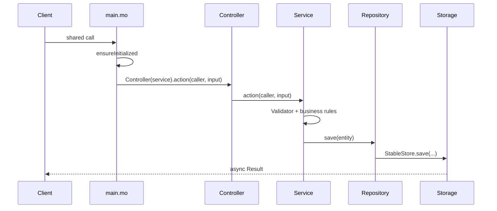

# Architecture — Layout, Layers & Request Flow

## Standard folder layout

```text
src/
├── main.mo                     # Actor entrypoint — wire only, no business logic
├── migrations/                 # Enhanced migration chain (YYYYMMDD_HHMMSS_*.mo)
├── api/v1/                     # Versioned public API (controllers)
├── services/                   # Business logic & orchestration
├── repositories/               # Data access (CRUD, queries)
├── storage/                    # Stable memory — only persistence layer
├── models/                     # Domain entities
├── dto/                        # API request/response shapes
├── validators/                 # Input & rule validation
├── config/                     # App constants, canister IDs
├── types/                      # Shared type aliases
├── utils/                      # Pure helpers (Logger, time, …)
├── ledger/                     # External canister clients (optional)
├── randomness/                 # ICP randomness wrappers (optional)
└── testing/                    # TestHarness, fixtures

backend/testing/<feature>/      # Local tests (*.test.mo) — not in public git
scripts/                        # build, test, deploy, verify
```

**One file = one responsibility.**

---

## Layer rules (strict)

### Allowed

```text
Controller  →  Service
Service     →  Repository, Validator, external client
Repository  →  Storage
```

### Forbidden

```text
Controller  →  Repository, Storage
Service     →  Storage (direct)
Storage     →  Service, Controller, Repository
Repository  →  Service (business rules)
```

| Layer | Owns | Must NOT contain |
|-------|------|------------------|
| `main.mo` | Public API, wiring, `<system>` hooks | Validation, storage, workflows |
| `api/v1/` | Forward caller, map to service, return DTOs | Business rules |
| `services/` | Workflows, domain rules, `Result` errors | Stable memory |
| `repositories/` | `findById`, `save`, `update`, `delete` | Prize math, auth policy |
| `storage/` | Maps, stable types, `toStable` / `fromStable` | Business decisions |
| `models/` | Entity records & variants | API formatting |
| `dto/` | Public response records | Internal state |
| `validators/` | Caller, amount, state checks | Side effects |

---

## Request flow



### Query flow (read-only)

```text
Client → main.mo → Service / Repository → DTO → Client
```

Never read storage directly from `main.mo`.
